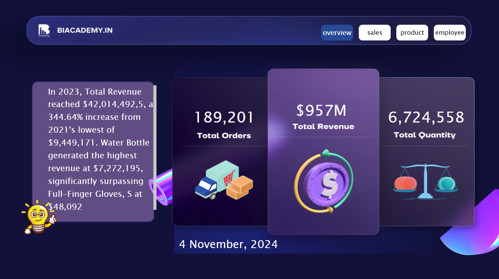
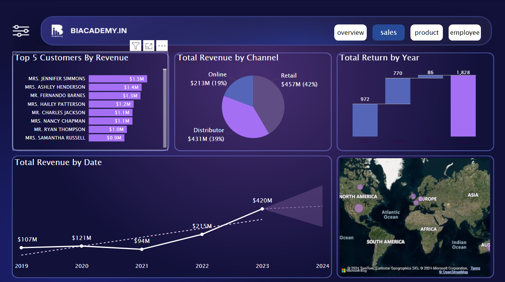
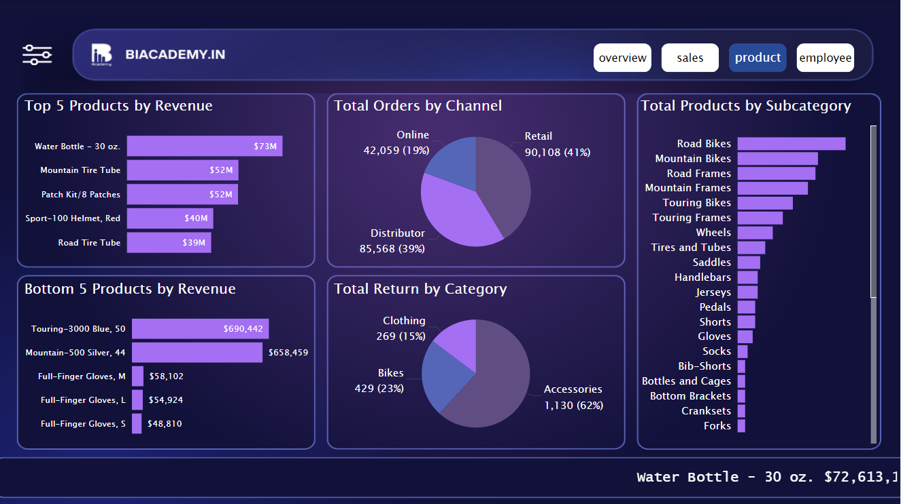
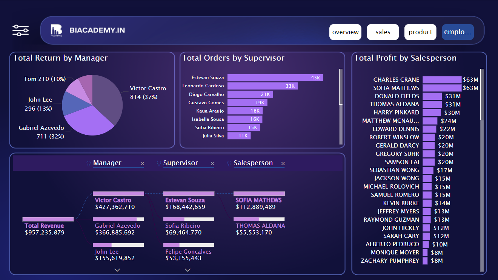
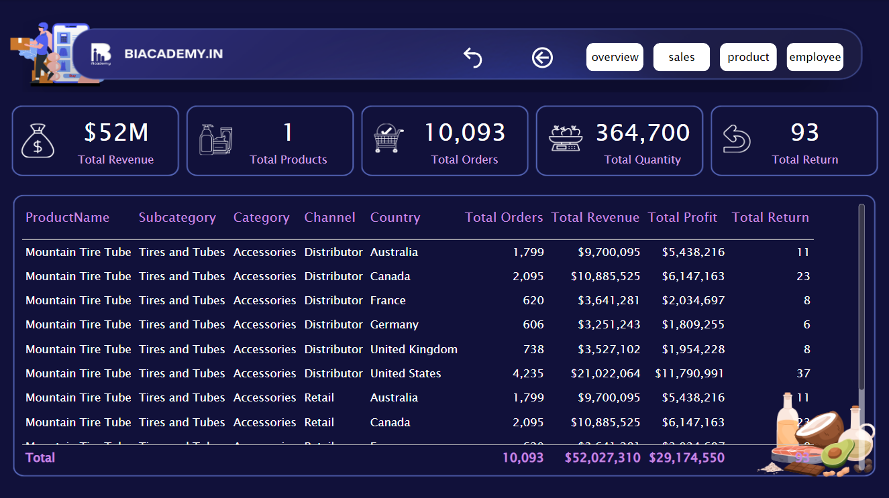
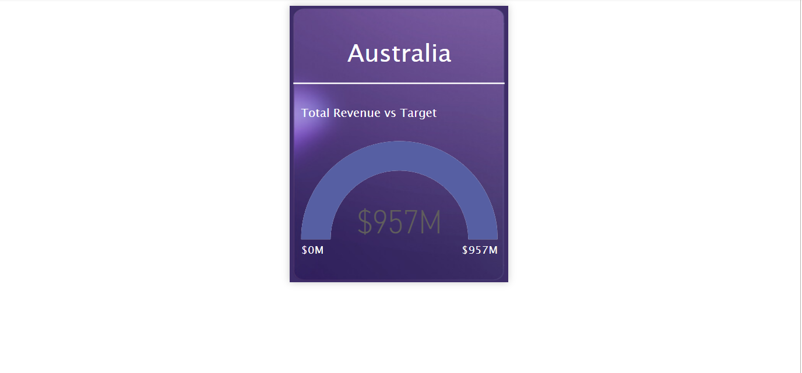

# E-Commerce-Dashboard

An interactive and data-driven e-commerce dashboard built with **Power BI** to visualize key metrics like sales, customer demographics, product performance, and more. This project helps e-commerce businesses track their performance, identify trends, and make data-driven decisions.

## Table of Contents
- [About the Project](#about-the-project)
- [Features](#features)
- [Technologies Used](#technologies-used)
- [Data Source](#data-source)
- [Screenshot of pages](#Screenshots)
- [Project](#Project)
- [Usage](#usage)
- [Contact](#contact)

---

## About the Project
This e-commerce dashboard provides valuable insights into sales trends, customer behavior, and product performance. It is designed for e-commerce analysts, marketing teams, and managers who need to monitor and analyze key business metrics in real-time. 

The dashboard offers visualizations like revenue trends, top-selling products, customer demographics, and region-wise sales distribution. All insights are accessible through interactive charts and filters, allowing users to drill down into specific details.

## Features
- **Sales Analysis**: Track total sales, revenue, and average order value over time.
- **Product Performance**: Identify top-selling products and analyze product categories.
- **Customer Insights**: View customer demographics (age, gender) and purchase patterns.
- **Regional Performance**: Analyze sales distribution across different regions.
- **Dynamic Filtering**: Filter data by time, category, region, and other parameters.
  
## Technologies Used
- **Power BI**: For creating interactive dashboards and visualizations.
- **Canvas**: For creating the background of pages.
- **Sample Dataset**: Sample sales data in CSV format or xslx format.

## Data Source
This project uses sample data that simulates typical e-commerce data:
- **Customers**: Contains customer demographic details like age, gender, and location.
- **Products**: Contains product details including category, price, and Model name.
- **Employee**: Contains Employee details, including supervisor, manager, channel.
- **Salesperson**: Contains Salespersons Id and merged with Employee table with power query.
- **Product category**: Contains category of products and merged with Product table with power query.
- **Product subcategory**: Contains subcategory of products and merged with Product table with power query
- **Returns**: Contains return quantity , including date, territory key and product key.
- **Sales**: Contains sales details like order date, order number, unit price, quantity and territory key from the year 2019 to 2023.
- **Location**: Contains region details including sales territory, country an continent .

## Screenshots
  **Overview Page**: The initial dashboard page is intentionally designed to be straightforward, featuring three crucial Key Performance Indicators (KPIs) and a concise narrative that encapsulates the entire report.
  

  **Sales Page**: This screenshot shows the sales overview page of the e-commerce dashboard. It includes key metrics such as Top 5 customer by revenue, total revenue by channel, date and location, Total return by year. This page provides insights of revenue trends over time and location with highly profitable.
   

  **Product Page**:This screenshot displays the product page of the e-commerce dashboard. It includes key metrics such as total revenue,top-selling and underperforming products, product views, Total revenue by channel and total return by category.This page provides insights into product performance, helping optimize stock management and sales strategies.
   

  **Employee Page**: This screenshot displays the employee page of the e-commerce dashboard. It provides a performance overview for each team member, allowing managers to track productivity, recognize high performers, and identify areas for support or training.
    

  **Drilldown Page**: It's a drilldown page, that showcases products in a detailed manner, enabling you to assess their performance and understand their growth. 
   

  **Tooltip**: It's a Tooltip page, designed for interactive and engaging tooltips to enrich the dashboard's overall quality.
    

## Project
  ## **Project** : [E-commerce_dashboard.pbix](https://app.powerbi.com/view?r=eyJrIjoiNjMyZGZiMGMtZTk3My00NThhLWFmOTEtNmU4MzNjNTBhNWMzIiwidCI6ImRiOThlOTIzLWQyZWEtNDY2MS1hZDE1LTI3YzUyNjA2MGEyYiJ9)
## Usage
1. **View the dashboard**:
   - Open Power BI and explore different report pages, charts, and filters.
2. **Filter and Interact**:
   - Use filters to drill down into data by category, date range, and region.
3. **Analyze Metrics**:
   - Gain insights into product performance, customer behavior, and sales trends.

## Contact
**Sahil Patra**  
GitHub: [Sahil-Patra](https://github.com/Sahil-Patra)  
Email: sahilpatra1004@gmail.com
Ph no.: +91 7735367833
---

**Thank you for checking out this project!** If you have any questions or feedback, please feel free to reach out.
Credit goes to Akshay Khamble Sir for teaching me how to create a dashboard. Thanks sir.

---
